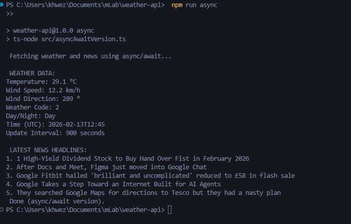

# Async Weather & News Dashboard

## Project Overview

This project demonstrates asynchronous programming in Node.js using TypeScript.

The application fetches current weather data and latest news headlines from public APIs and implements the same functionality using:

- Callbacks
- Promises
- Async/Await
- Promise.all()
- Promise.race()

The purpose of this project is to demonstrate understanding of the Node.js event loop and different asynchronous programming patterns.

---

## Technologies Used

- Node.js
- TypeScript
- Axios
- Node HTTPS module

---

## APIs Used

### Weather API

Open-Meteo API  
https://api.open-meteo.com/

### News API

GNews API  
https://gnews.io/

---

## Project Structure

src/
├── callbackVersion.ts
├── promiseVersion.ts
├── asyncAwaitVersion.ts
└── utils.ts

- `callbackVersion.ts` – Implements asynchronous logic using callbacks (demonstrates callback nesting).
- `promiseVersion.ts` – Uses Promises with `.then()`, `.catch()`, `Promise.all()`, and `Promise.race()`.
- `asyncAwaitVersion.ts` – Refactors Promise logic using `async/await` with `try...catch`.
- `utils.ts` – Contains API URLs, TypeScript types, and shared display logic.

---

## Installation

### 1. Clone the repository

git clone https://github.com/Ashley-Blu/task6-weather-api

### 2. Navigate into the project folder

cd weather-api

### 3. Install dependencies

npm install

---

## Running the Project

### Run Callback Version

npm run callback

### Run Callback Promise

npm run promise

### Run Async/Await Version

npm run async

---

## Sample output

